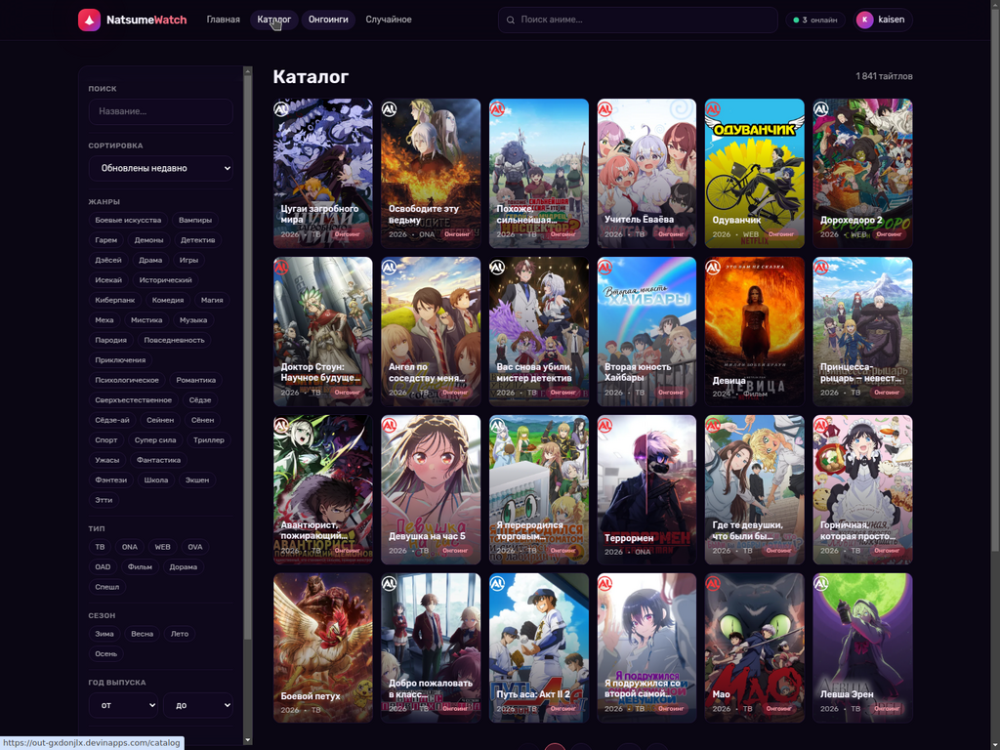
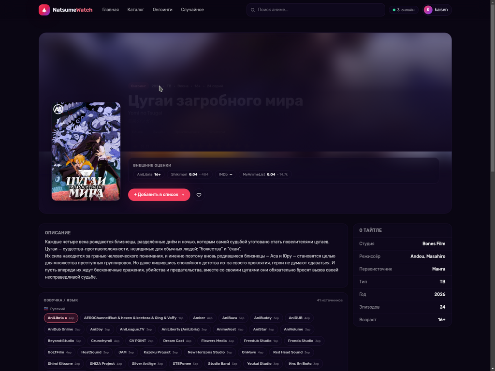
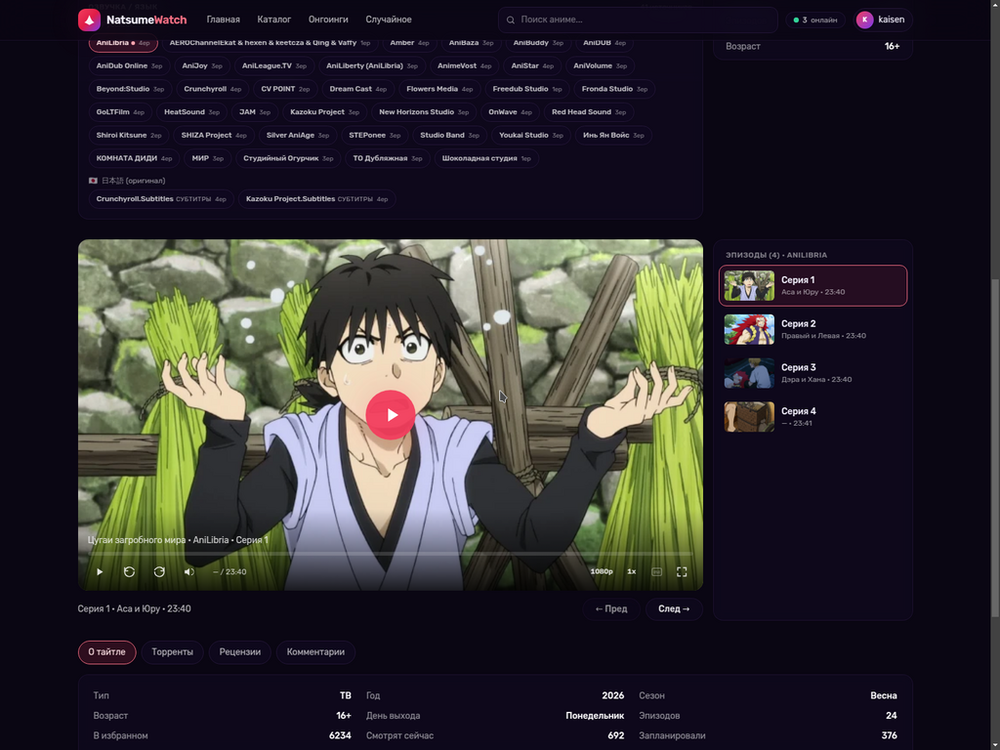

# NatsumeWatch

Современный сайт для просмотра аниме на основе открытого API
[AniLibria v1](https://anilibria.top/api/docs/v1) с агрегатором озвучек
[Kodik](https://kodik.cc/) и метаданными из
[Jikan](https://docs.api.jikan.moe/) (MyAnimeList).

- 🌐 **Сайт:** <https://out-gxdonjlx.devinapps.com>
- ⚙️ **API:** <https://natsumewatch-backend-wsjmfcnv.fly.dev>
  ([Swagger](https://natsumewatch-backend-wsjmfcnv.fly.dev/docs))


## Возможности

### Каталог и контент

- Главная с hero-каруселью онгоингов и рядами «Свежие релизы», «Прошлый сезон».
- Каталог из 1800+ тайтлов с фильтрами: жанр, тип (TV/ONA/WEB/Фильм/Дорама/...),
  сезон, год (от/до), возрастной рейтинг, статус, сортировка.
- Поиск по названию с моментальными подсказками.
- Случайный тайтл (кнопка «Случайное»).



### Страница тайтла

- **Три названия** в hero: главное (русское), ромадзи/латиница
  (например, `Yomi no Tsugai`), английское и японский kanji — что доступно из
  AniLibria и Jikan.
- **Внешние оценки**: AniLibria, Shikimori, IMDb, MyAnimeList, Кинопоиск
  (агрегируются из Kodik `material_data` и Jikan).
- **Мета-сайдбар**: студия (`Bones Film`, `Ufotable`, `MAPPA` и т.п.),
  режиссёр, первоисточник (Манга, Ранобэ, Игра, Оригинал, ...), тип, год,
  количество эпизодов, длительность, возрастной рейтинг.
- Описание, рецензии, комментарии, пользовательский рейтинг, добавление
  в личные списки.
- Торренты от AniLibria (1080p/720p/480p, magnet + .torrent + сидеры/личеры).



### Озвучки и плеер

- **Мульти-источник озвучек** через Kodik: десятки русских студий
  (AniLibria, AniDUB, AniStar, Crunchyroll, SHIZA, Studio Band, ...) + английские
  дубляжи + японский оригинал с субтитрами Crunchyroll.
- Дедупликация дублирующихся озвучек по `studio + language + kind` с выбором
  лучшего варианта по качеству (1080 > 720 > 480) и репутации студии.
- Фильтрация мусорных источников (Red Tail для дорам и т. п.).
- **Своя реализация HLS-плеера** на [hls.js](https://github.com/video-dev/hls.js)
  для нативного источника AniLibria — стабильнее iframe.
- Iframe-плеер Kodik для остальных озвучек.
- Раздельные кнопки: качество (480/720/1080), скорость (0.75–2x), включить/выключить
  субтитры, full-screen.
- Горячие клавиши: `Space`/`K` — пауза, `←`/`→` — ±5 сек, `↑`/`↓` — громкость,
  `M` — mute, `F` — fullscreen.
- Авто-resume серии при смене озвучки на ту же серию.



### Профиль и социальные фичи

- Регистрация и логин по email + JWT (без 2FA).
- Загрузка **аватара** и **баннера** профиля (PNG/JPG/GIF/WebP, до 5 МБ;
  GIF сохраняется анимированным, статика рекомпрессится в JPEG q88).
- Шесть пользовательских **списков**: «Запланировано», «Смотрю», «Просмотрено»,
  «Отложено», «Брошено», «Избранное».
- **Статистика просмотренного** — текстовая (по жанрам/типам/годам) и две
  круговые диаграммы.
- **История просмотра** с возможностью отключения и очистки в настройках
  (60-секундный dedup на бэке).
- **Онлайн-статус** per-user через heartbeat: «● В сети» / «Был N мин назад».
- Публичная страница пользователя `/users?id=N` со списками этого пользователя.
- In-memory счётчик «онлайн сейчас» в шапке.

### Мобильный UX

- Адаптивный header с иконочной панелью (каталог, поиск, настройки, профиль, меню).
- Мобильный поиск открывается как отдельная панель по нажатию на иконку.
- Закреплённый bottom-nav на мобиле: **Главная / Топ 100 / Каталог / Случайное**.
- Safe-area-inset для устройств с home-indicator.

## Стек

| Слой        | Технологии |
| ----------- | ---------- |
| Frontend    | Next.js 14 (App Router, static export), React 18, TypeScript, Tailwind CSS, SWR, Zustand, Recharts, hls.js |
| Backend     | FastAPI, SQLAlchemy 2 async, JWT, httpx, Pillow |
| База данных | SQLite (на Fly volume `/data/app.db`); легко переключается на Postgres через `DATABASE_URL` |
| Хранилище   | Fly persistent volume `/data/uploads/...` для аватаров и баннеров |
| Хостинг     | Fly.io (бэкенд), Devin Apps / Fly static (фронтенд статикой) |
| Источники   | [AniLibria v1](https://anilibria.top/api/docs/v1) (каталог + HLS), [Kodik](https://kodik.cc/) (озвучки), [Jikan v4](https://docs.api.jikan.moe/) (студия / режиссёр / источник / MAL-рейтинг) |
| Шрифт       | [Rubik](https://fonts.google.com/specimen/Rubik) (cyrillic + latin, 400–900) через `next/font/google` |

## Структура репо

```
.
├── backend/              # FastAPI приложение
│   ├── app/
│   │   ├── main.py       # entrypoint, CORS, lifespan
│   │   ├── routers/      # auth, anime, me, users, social, stats
│   │   ├── anilibria.py  # клиент AniLibria v1
│   │   ├── kodik.py      # клиент Kodik (с авто-ротацией токенов)
│   │   ├── jikan.py      # клиент Jikan (студии, режиссёр, source)
│   │   ├── presence.py   # in-memory online-трекер + last_seen_at
│   │   ├── models.py     # SQLAlchemy ORM
│   │   └── ...
│   ├── pyproject.toml
│   └── .env.example
└── frontend/             # Next.js 14 фронтенд
    ├── src/
    │   ├── app/          # роуты (App Router)
    │   ├── components/   # Player, KodikPlayer, DubSwitcher, Header, MobileBottomNav, ListPicker, RatingsBar, ...
    │   └── lib/          # api, types, auth, posters, format
    ├── package.json
    └── next.config.js
```

## Локальный запуск

### Backend

```bash
cd backend
python3 -m venv .venv
source .venv/bin/activate
pip install -e .
cp .env.example .env  # отредактируйте при желании
uvicorn app.main:app --reload --port 8001
```

API доступно на <http://127.0.0.1:8001>, Swagger — на `/docs`.

### Frontend

```bash
cd frontend
npm install
NEXT_PUBLIC_API_URL=http://127.0.0.1:8001 npm run dev
```

Откройте <http://localhost:3000>.

### Production-сборка фронта (статикой)

```bash
cd frontend
NEXT_OUTPUT=export NEXT_PUBLIC_API_URL=https://your-backend.example npm run build
# результат — в frontend/out/
```

## Переменные окружения

### Backend (`backend/.env`)

| Переменная              | По умолчанию                              | Описание |
| ----------------------- | ----------------------------------------- | -------- |
| `DATABASE_URL`          | `sqlite+aiosqlite:///./natsumewatch.db`   | SQLAlchemy async DSN |
| `JWT_SECRET`            | `change-me-in-production-please`          | Секрет для подписи JWT |
| `CORS_ORIGINS`          | `*`                                       | Список origins через запятую |
| `UPLOADS_DIR`           | `/data/uploads`                           | Куда складывать аватары/баннеры |
| `ANILIBRIA_BASE_URL`    | `https://anilibria.top/api/v1`            | URL AniLibria API |
| `KODIK_TOKEN`           | (авто из YaNesyTortiK feed)               | Опционально — свой токен Kodik |

### Frontend

| Переменная             | Описание |
| ---------------------- | -------- |
| `NEXT_PUBLIC_API_URL`  | URL backend; используется для запросов и rewrites |
| `NEXT_OUTPUT`          | `export` для статической сборки (`npm run build` → `frontend/out/`) |

## Ключевые API-эндпоинты

| Метод | Путь | Описание |
| ----- | ---- | -------- |
| `GET` | `/api/anime/catalog` | Каталог с фильтрами и пагинацией |
| `GET` | `/api/anime/references` | Жанры, годы, типы, сезоны, рейтинги, сортировки |
| `GET` | `/api/anime/{id_or_alias}` | Карточка тайтла |
| `GET` | `/api/anime/{id_or_alias}/dubs` | Все доступные озвучки (AniLibria + Kodik) |
| `GET` | `/api/anime/{id_or_alias}/meta` | Студия, режиссёр, первоисточник, JP-название |
| `GET` | `/api/anime/{id_or_alias}/ratings` | Внешние оценки (Shikimori / IMDb / MAL / Кинопоиск) |
| `GET` | `/api/anime/{id_or_alias}/torrents` | Торренты AniLibria с magnet и .torrent |
| `POST`| `/api/auth/register` / `/login` | Регистрация и логин (JWT) |
| `GET` | `/api/me` | Текущий пользователь |
| `POST`| `/api/me/avatar` / `/api/me/banner` | Загрузка изображений |
| `PUT` | `/api/me/lists` | Добавить тайтл в список |
| `GET` | `/api/me/stats` | Агрегированная статистика по жанрам/годам/типам |
| `GET` | `/api/me/history` | История просмотра |
| `POST`| `/api/me/heartbeat` | Heartbeat presence-трекера |
| `GET` | `/api/users/{id}/online` | Онлайн-статус пользователя |

## Лицензия и контент

Сервис работает с публичным API AniLibria и агрегатором Kodik. Всё содержимое
(постеры, описания, видеопотоки) принадлежит правообладателям. Сам сайт ничего
не хостит — это только клиент для удобного просмотра.
