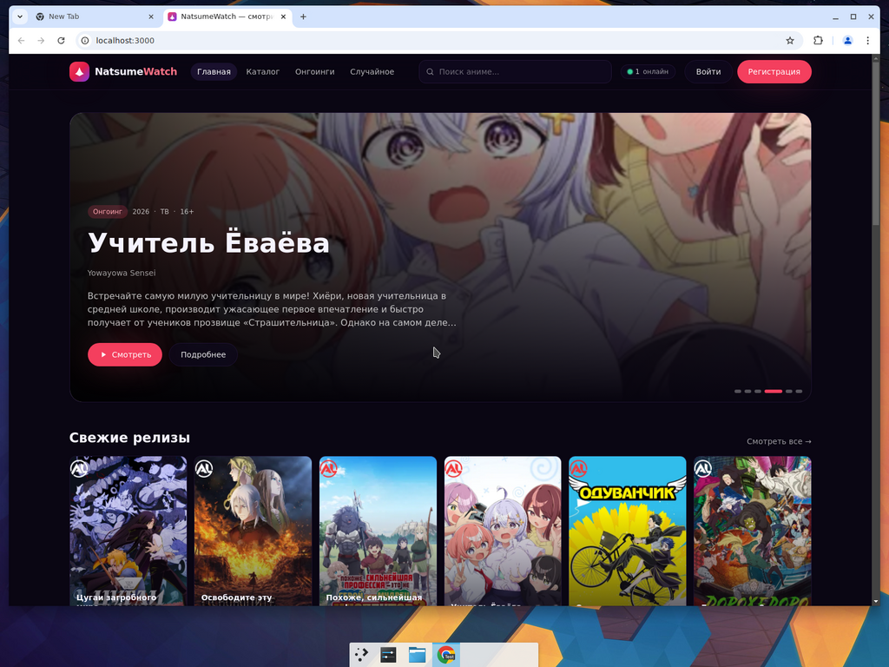

# NatsumeWatch

Современная платформа для просмотра аниме на основе открытого API
[AniLibria](https://anilibria.top/api/docs/v1).



## Стек

- **Frontend**: Next.js 14 (App Router), TypeScript, Tailwind CSS, SWR, Zustand,
  [hls.js](https://github.com/video-dev/hls.js) для адаптивного HLS-воспроизведения.
- **Backend**: FastAPI, SQLAlchemy 2 (async), SQLite (по умолчанию, легко переключается
  на Postgres), JWT-аутентификация, in-memory presence-трекер для счётчика «онлайн».
- **Источник контента**: AniLibria v1 (каталог, поиск, фильтры, эпизоды + HLS 480p/720p/1080p).

## Возможности

- Главная с hero-каруселью, рядами «свежие», «онгоинги», «прошлый сезон».
- Каталог с фильтрами: жанр, тип, сезон, год (от/до), возрастной рейтинг, статус, сортировка.
- Поиск с моментальными подсказками.
- Страница тайтла: описание, метаданные, плеер с переключением серий и качества, рецензии,
  комментарии, рейтинг.
- HLS-плеер: адаптивное качество, ручное переключение 480/720/1080, скорости 0.75–2x,
  full-screen, горячие клавиши (`Space`, `K`, `M`, `F`, `←`/`→`, `↑`/`↓`).
- Аккаунты: регистрация, логин (JWT), профиль.
- Счётчик «онлайн сейчас» в шапке (in-memory, обновляется heartbeat'ом каждые 45 секунд).

## Локальный запуск

### Backend

```bash
cd backend
python3 -m venv .venv
source .venv/bin/activate
pip install -e .
cp .env.example .env  # отредактируйте при желании
uvicorn app.main:app --reload --port 8001
```

### Frontend

```bash
cd frontend
npm install
NEXT_PUBLIC_API_URL=http://127.0.0.1:8001 npm run dev
```

Откройте <http://localhost:3000>.

## Переменные окружения

### Backend (`backend/.env`)

| Переменная     | По умолчанию                                  | Описание                              |
| -------------- | --------------------------------------------- | ------------------------------------- |
| `DATABASE_URL` | `sqlite+aiosqlite:///./natsumewatch.db`       | SQLAlchemy async DSN                  |
| `JWT_SECRET`   | `change-me-in-production-please`              | Секрет для подписи JWT                |
| `CORS_ORIGINS` | `*`                                           | Список origins через запятую          |

### Frontend

| Переменная             | Описание                                |
| ---------------------- | --------------------------------------- |
| `NEXT_PUBLIC_API_URL`  | URL backend; используется для rewrites  |

## Лицензия / контент

Сервис работает с публичным API AniLibria. Всё содержимое (постеры, описания, видеопотоки)
принадлежит правообладателям и AniLibria. Сам сайт ничего не хостит.
